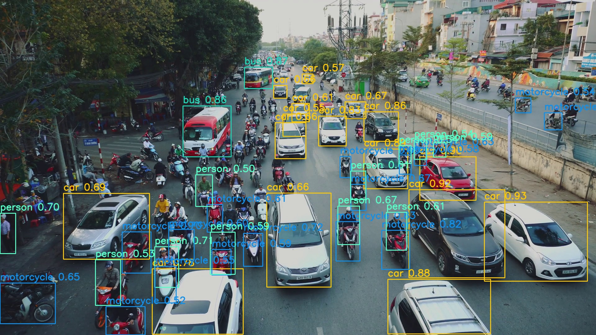

# Python & C++ wrapper for End-to-End YOLOv7
- Original repo: https://github.com/WongKinYiu/yolov7
- NMS Plugin: https://github.com/NVIDIA/TensorRT/tree/main/plugin/batchedNMSPlugin

## 1. TensorRT Python
### Convert to ONNX
- Clone and put ```tools/export.py``` and ```tools/add_nms_plugins.py``` to [original yolov7 repo](https://github.com/WongKinYiu/yolov7)
- Run ```python export.py --weights yolov7x.pt --dynamic  --simplify``` to get ```yolov7x.onnx```
- Run ```python add_nms_plugins.py --model yolov7x.onnx``` to add NMS Plugin and get ```yolov7x-nms.onnx```

<i> Note: This is dynamic shape ONNX model </i>
### Convert to TensorRT
Convert ONNX to TensortRT with dynamic input shape in range ```1x3x640x640```-```4x3x896x896```
```
  /usr/src/tensorrt/bin/trtexec --onnx=yolov7x-nms.onnx \
                              --saveEngine=yolov7x-nms-fp16.trt \
                              --explicitBatch \
                              --minShapes=input:1x3x640x640 \
                              --optShapes=input:1x3x640x640 \
                              --maxShapes=input:4x3x896x896 \
                              --verbose \
                              --device=1 \
                              --workspace=512 \
                              --fp16
```
#### Run Sample Demo
```
  python object_detector_trt_nms.py
```
<p align="center">
   <br>
  <i> Output of <b>YOLOv7X-1x3x640x640 thresh 0.5</b>. For better result, just resize input larger</i>
</p>

## 2. TensorRT C++
### Sample Application for Video/RTSP input
```
  cd C++
  mkdir build && cd build
  make
  ./object_detector test.mp4
```
